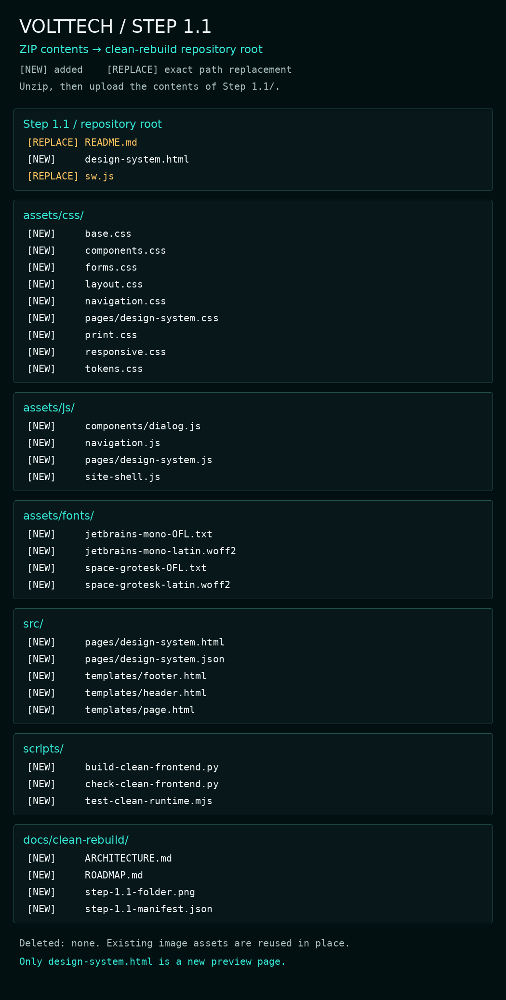

# Step 1.1 — Shared frontend foundation

Project position: previous major **Step 0 — Repository audit ✅**; current major **Step 1 — Frontend foundation ⚡**; next major **Step 2 — Core commerce 🚫**.

Step 1.1 code and automated checks are ready. Manual upload and visual/device verification remain pending 🧪. Next substep: **Step 1.2 — Homepage and shared navigation**.

## Objective and lineage

Build a clean, reusable frontend foundation and an isolated inspection page before rebuilding the homepage. Parent Step: **Step 1 — Frontend foundation**. Previous Step: **Step 0 — Repository and system audit**. Next planned Step: **Step 1.2 — Homepage and shared navigation**.

Repository: `VoltTechComputerCo/VoltTechComputerCo.github.io`. All work is on `clean-rebuild`. Remote `clean-rebuild` and `v2-rebuild` were rechecked before implementation; both point to `a7b182af9557a4c22ce79250a8f71c6824a50cb3` (`refactor: make V2 layout source-first`). No v3-prototype implementation was inherited. This ZIP does not publish or push anything.

This README supersedes the root README's old V2 branch and design instructions. Historical V2 docs remain functional documentation for unconverted systems. Start new work with `docs/clean-rebuild/ARCHITECTURE.md` and `ROADMAP.md`. Do not run the legacy V2 finaliser for this rebuild.

## Files added (30)

- `assets/css/base.css`
- `assets/css/components.css`
- `assets/css/forms.css`
- `assets/css/layout.css`
- `assets/css/navigation.css`
- `assets/css/pages/design-system.css`
- `assets/css/print.css`
- `assets/css/responsive.css`
- `assets/css/tokens.css`
- `assets/fonts/jetbrains-mono-OFL.txt`
- `assets/fonts/jetbrains-mono-latin.woff2`
- `assets/fonts/space-grotesk-OFL.txt`
- `assets/fonts/space-grotesk-latin.woff2`
- `assets/js/components/dialog.js`
- `assets/js/navigation.js`
- `assets/js/pages/design-system.js`
- `assets/js/site-shell.js`
- `design-system.html`
- `docs/clean-rebuild/ARCHITECTURE.md`
- `docs/clean-rebuild/ROADMAP.md`
- `docs/clean-rebuild/step-1.1-folder.png`
- `docs/clean-rebuild/step-1.1-manifest.json`
- `scripts/build-clean-frontend.py`
- `scripts/check-clean-frontend.py`
- `scripts/test-clean-runtime.mjs`
- `src/pages/design-system.html`
- `src/pages/design-system.json`
- `src/templates/footer.html`
- `src/templates/header.html`
- `src/templates/page.html`

## Files changed

- `README.md` — replace old V2 handover with this Step record and clean-rebuild entry point.
- `sw.js` — return explicitly marked clean documents unchanged; preserve old-route rewriting and notification injection.

## Files deleted

None. The inspection page is a new route. No existing page implementation is replaced in this Step.

## Files superseded

The previous root README is superseded by this one. No other file is superseded. The new page does not import legacy styles, analytics/navigation injectors or page controllers. Their remaining consumers are unconverted routes and will be migrated and cleaned up atomically. No override or backup runtime files have been added.

## Backend systems touched

None. The service worker is a frontend response boundary; it does not alter Supabase or backend state. Tests verify preserved behaviour for unconverted pages.

## Backend systems untouched

Supabase schema, RLS, authentication, customer profiles, orders, quotes, documents, service history, saved builds, notifications, Store/cart storage and events, checkout, Yoco, shipping, Builder engines and compatibility data, Signal Scan, analytics event code, WhatsApp/email handoffs, Discord/webhooks, creator feeds and STATIC publishing. Store/Builder/payment launch flags remain unchanged. Audit findings remain open; this Step does not certify those systems for launch.

## Visual changes

- Exact supplied base palette in one token file; Space Grotesk and JetBrains Mono served locally.
- Compact dark navigation, thin teal dividers, dense image cards, square-edged shared controls, technical labels and structured footer.
- Inspection-page hero, palette/type specimens, hardware cards, tool panels, disclosures, state labels and form examples.
- Shared mobile breakpoints, large tap targets, visible focus, reduced-motion support and print treatment.
- Official existing VoltTech logo and correct existing hardware imagery reused in place; no generated imagery or product claims.

The supplied reference guides the foundation. This is a component inspection page, not the finished homepage. Hero artwork, full homepage section composition, connected account/cart states and search belong to subsequent work.

## Functional changes

A dependency-free Python template generator owns one header/footer source and produces upload-ready HTML. JavaScript progressively enhances mobile navigation, a native dialog and local form validation. Navigation remains visible without JavaScript. Example controls never send or store data; unavailable controls are labelled. Existing links lead to their baseline routes and existing access gates.

`<html data-vt-shell="clean">` is the explicit service-worker boundary. Only the inspection route carries it. Future migrated business pages must reconnect their required adapters before using this marker. No new Supabase, analytics or transaction requests occur on the inspection page.

## SEO changes

`design-system.html` uses `noindex, nofollow`, en-ZA, a distinct title/description, semantic landmarks and one H1. It is not added to navigation or the sitemap. No fabricated product, organisation, review or diagnostic structured data. Production page metadata and established URLs are unchanged.

## Dependencies

Runtime: modern browser with CSS Grid and JavaScript modules; native `<dialog>` enhancement where supported. No framework, package manager or external runtime library. Fonts include their SIL OFL licences. Content, navigation and native disclosures remain usable without JavaScript.

Existing reused assets: `brand/VoltTech_Full_Logo_Transparent.png`, `vt-own-tower.webp`, `vt-own-gpu-product.webp`, `vt-drive-motherboard.webp`, `vt-stock-cooling-rgb.webp`, `vt-stock-modern-build.webp`, and `icons/favicon.ico`. They are already on the verified parent and are not duplicated in this delta ZIP.

Developer generation/checks: Python 3 standard library and Node.js 18+ for JavaScript syntax/runtime-contract tests. Uploading the ZIP requires neither.

```sh
python3 scripts/build-clean-frontend.py
python3 scripts/check-clean-frontend.py
node scripts/test-clean-runtime.mjs
```

## Test checklist and evidence

Completed:

- [x] Remote branch/base identity checked immediately before implementation.
- [x] Generated HTML matches shared template and page sources.
- [x] Local page links, CSS/font/image paths, JS imports and page anchors resolve.
- [x] No duplicate IDs, unresolved ARIA/label references, inline styles or handlers.
- [x] Exactly one header, main, H1 and footer on the inspection route.
- [x] New JavaScript and service-worker syntax checks pass.
- [x] Service-worker contract tests: clean HTML unchanged; old rewriting/loader preserved; no duplicate loader; error, non-HTML, cross-origin and non-navigation responses preserved.
- [x] Navigation contract tests: mobile disclosure, Escape, closing on selection and focus recovery when crossing breakpoints.
- [x] No legacy CSS/scripts or backend/network/storage calls in the new inspection runtime.
- [x] Official font binaries decode as variable WOFF2; licence files included.
- [x] Git whitespace/diff check.
- [x] Delivery overlay and exact rollback rehearsal against the recorded parent (packaging verification).

Manual checks after upload (not claimed as passed):

- [ ] At 360, 390 and 412px: no horizontal scrolling; readable cards/labels; comfortable tap targets.
- [ ] Tablet, desktop and wide desktop composition, image crops and font loading.
- [ ] Mobile Menu/Close, Escape and resizing; keyboard focus visible and logical.
- [ ] Open/close dialog, Tab containment, Escape and focus return.
- [ ] Blank/short notes show inline error; valid notes show local success without network transmission.
- [ ] No console errors or missing assets in GitHack.
- [ ] No-JavaScript navigation/content and print layout.
- [ ] User visual approval against reference direction.

Supabase/auth/account state, live Store/cart, Yoco, Builder and Signal Scan execution were **not** transactionally retested in this visual foundation Step. Their code and hooks were not changed. Production service-worker update/cached transitions remain Step 1.3 QA. Source-level tests are not a claim of pixel-perfect, browser or accessibility certification.

## Upload instructions

1. Extract `Step 1.1.zip`. The outer folder is `Step 1.1/`.
2. In GitHub, select **clean-rebuild**, not main or v2-rebuild.
3. Upload the **contents** of `Step 1.1/` to the repository root, preserving subfolders. Do not upload the enclosing Step folder as a new repository directory.
4. Replace `README.md` and `sw.js` at their existing paths. Add all listed new files. No deletions are required.
5. Commit the upload. Suggested message: `Step 1.1 — shared frontend foundation`.
6. Open the single preview link below and inspect it. Tell me when uploaded, with any visual feedback. I will verify actual HEAD/files/hashes and supply the commit-pinned link before continuing.

`step-1.1-manifest.json` records exact SHA-256 hashes for all delivered files except itself; its omission avoids a circular checksum. Added/changed/deleted lists cover every delivered repository path.

## Preview URLs — changed pages only

**Available after uploading this ZIP:**

[Design-system inspection page](https://raw.githack.com/VoltTechComputerCo/VoltTechComputerCo.github.io/clean-rebuild/design-system.html)

The new page does not exist on the recorded parent SHA. No new commit-specific preview can honestly be supplied before the manual upload. After upload, the same path will be supplied with verified commit SHA in place of `clean-rebuild`. If GitHack shows an external-content notice, open the page through its normal prompt. The user has authorised GitHack and will verify visually.

No homepage or secondary customer page changed, so no additional preview links are included. The inspection page's existing route links leave this isolated preview and open baseline pages; production login/payment testing is outside this Step.

## Rollback

**Rollback target: Step 0 — audited baseline**, exact commit `a7b182af9557a4c22ce79250a8f71c6824a50cb3`.

Restore `README.md` and `sw.js` byte-for-byte from that commit and remove every path under `added` in `docs/clean-rebuild/step-1.1-manifest.json`. Deleted/superseded implementation paths: none. Reverting only an identifiable Step 1.1 upload commit is an equivalent tracked-file rollback if that commit contains exactly this package. Do not reset unrelated later work. A requested rollback ZIP will use the exact original bytes, not reconstructed versions.

## Known limitations and next work

- The page is ready for upload; it has not been published or visually approved.
- Existing pages still use their audited frontend. New global styles propagate only to routes adopting this shared template.
- Analytics/launch access/notifications/app-registration separation follows the first business-page migration in Step 1.2; the old responsibilities are not removed while other routes depend on them.
- The V2 finaliser remains historical operational code for now. Its retirement belongs to the homepage migration. It must never be dispatched for clean-rebuild.
- A previously installed old production service worker may require its normal update cycle; this does not affect a fresh GitHack inspection page.
- This is a visual preview, not an approved auth/payment staging origin.
- No stock, price, review, delivery, warranty, partnership or hardware-health claims are introduced.

## Folder map



```text
Step 1.1/
├── README.md
├── assets/
│   ├── css/
│   │   ├── base.css
│   │   ├── components.css
│   │   ├── forms.css
│   │   ├── layout.css
│   │   ├── navigation.css
│   │   ├── pages/
│   │   │   └── design-system.css
│   │   ├── print.css
│   │   ├── responsive.css
│   │   └── tokens.css
│   ├── fonts/
│   │   ├── jetbrains-mono-OFL.txt
│   │   ├── jetbrains-mono-latin.woff2
│   │   ├── space-grotesk-OFL.txt
│   │   └── space-grotesk-latin.woff2
│   └── js/
│       ├── components/
│       │   └── dialog.js
│       ├── navigation.js
│       ├── pages/
│       │   └── design-system.js
│       └── site-shell.js
├── design-system.html
├── docs/
│   └── clean-rebuild/
│       ├── ARCHITECTURE.md
│       ├── ROADMAP.md
│       ├── step-1.1-folder.png
│       └── step-1.1-manifest.json
├── scripts/
│   ├── build-clean-frontend.py
│   ├── check-clean-frontend.py
│   └── test-clean-runtime.mjs
├── src/
│   ├── pages/
│   │   ├── design-system.html
│   │   └── design-system.json
│   └── templates/
│       ├── footer.html
│       ├── header.html
│       └── page.html
└── sw.js
```
