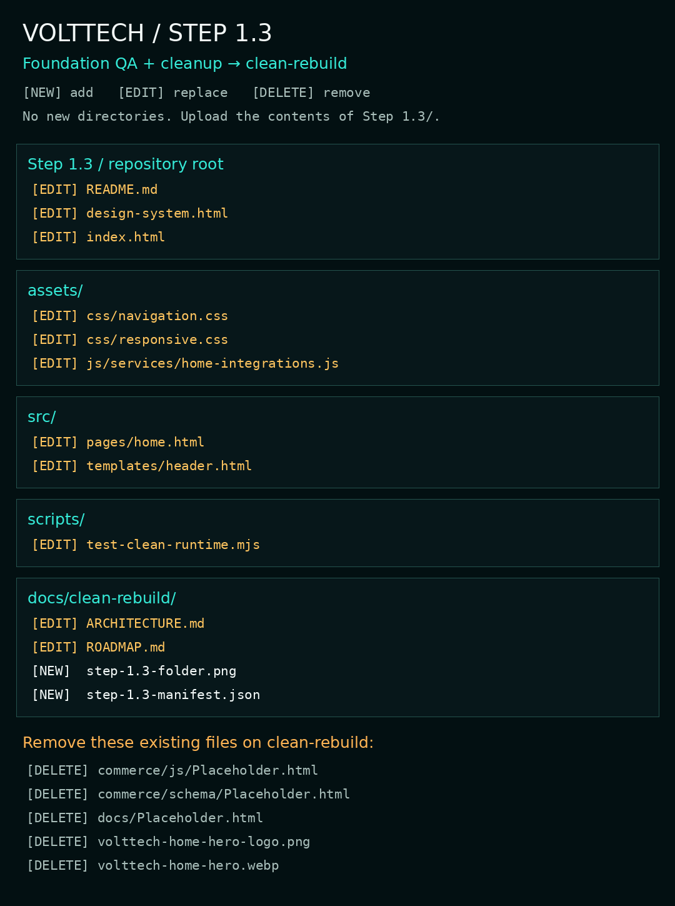

# Step 1.3 — Foundation QA and cleanup

Project position: previous major **Step 0 — Repository audit ✅**; current major **Step 1 — Frontend foundation ⚡**; next major **Step 2 — Core commerce 🚫**.

Previous: **Step 1.2 — Homepage upload verified ✅**. Current: **Step 1.3 — QA fixes ready; upload verification pending 🧪**. Next: **Step 2.1 — Store catalogue and product discovery 🚫**.

## Objective and lineage

Close the initial foundation QA pass with a usable cart route on narrow phones, consistent cart labels, clearer component enquiries and removal of replaced/empty files.

- Step identifier: **Step 1.3**
- Parent Step: **Step 1 — Frontend foundation**
- Previous Step: **Step 1.2 — Homepage and shared navigation**
- Next planned Step: **Step 2.1 — Store catalogue and product discovery**
- Repository: `VoltTechComputerCo/VoltTechComputerCo.github.io`
- Working branch: **clean-rebuild**
- Latest inspected parent: `d659bad184e002aaa28468663dab83f213225613` — `Delete assets/js/services/Placeholder.txt`

A fresh checkout was used. Step 1.2's 43 delivered files and 12 listed deletions had already been verified at `7db853fb7f22e949ca82c27e8cc67e2e4cdeadea`. The current checkout preserves the delivery bytes and includes the user's three subsequent folder-placeholder deletions. HEAD was checked again before packaging. No files from v3-prototype were inherited. No repository push or production deployment was performed.

## Files added (2)

- `docs/clean-rebuild/step-1.3-folder.png`
- `docs/clean-rebuild/step-1.3-manifest.json`

## Files changed (11)

- `README.md`
- `assets/css/navigation.css`
- `assets/css/responsive.css`
- `assets/js/services/home-integrations.js`
- `design-system.html`
- `docs/clean-rebuild/ARCHITECTURE.md`
- `docs/clean-rebuild/ROADMAP.md`
- `index.html`
- `scripts/test-clean-runtime.mjs`
- `src/pages/home.html`
- `src/templates/header.html`

## Files deleted (5) — remove manually

- `commerce/js/Placeholder.html`
- `commerce/schema/Placeholder.html`
- `docs/Placeholder.html`
- `volttech-home-hero-logo.png`
- `volttech-home-hero.webp`

The three `Placeholder.html` files are older baseline stubs, separate from the folder placeholders already deleted by the user. Their contents were empty or the word “Placeholder”; no imports or links referenced them. The two old homepage image files also had no remaining references. The current hero remains at `assets/brand/home-hero.webp`; the official source logo and optimised shared logo remain intact.

ZIP upload cannot delete files. Remove the five paths above as part of this Step, leaving their directories and other files intact.

## Files superseded

- Previous shared header output is regenerated from `src/templates/header.html` on both converted pages.
- Previous single-control cart presentation is replaced by a shared update for both `[data-cart-link]` controls.
- The unused legacy hero files are removed; their replacements were already delivered in Step 1.2.
- This README supersedes the Step 1.2 root handover. The exact prior commit and manifest remain the rollback record.

## Backend systems touched

No backend system was changed. The homepage cart display reads the same existing `vt_store_quote_cart_v1` storage key and listens to the same `vt-store-cart-change` / storage events. It updates both desktop and phone-menu labels, handles singular/plural wording, and makes no storage writes. Both controls link to the existing `store.html?cart=1` route, whose launch gate remains authoritative.

## Backend systems untouched

Supabase data/schema/RLS/authentication, account sessions, profiles, notification queries/actions, orders, quotes, invoices, receipts, documents, saved builds, service history, Store catalogue and checkout controllers, Yoco, Builder compatibility engines, Signal Scan/Stream Scan, creator feed jobs, analytics IDs/events, email, Discord/webhooks and STATIC publishing. No flags, stock, prices or payment settings were enabled or changed. The account and production-service functions within the edited integration file are unchanged.

## Visual changes

- At 40rem and below, the mobile menu gains a Cart item where the header cart icon is hidden. It fills the sixth position in the two-column menu without compressing the header touch targets.
- The existing desktop composition, hero, cards, fonts, colours and footer remain the approved direction.
- Component enquiry links now ask naturally about “a processor upgrade”, “a new PC case”, etc.
- No new images, fonts, visual overrides or page-specific navigation implementation were introduced.

## Functional changes

Both cart displays use one read-only update function. They update on same-tab cart events and cross-tab storage changes; blocked/malformed storage shows a safe empty state. Counts never become product availability claims. The shared inspection page has the route but does not load customer cart/account integrations.

Homepage component messages preserve each card's intent through existing WhatsApp handoff logic. JavaScript-disabled links remain usable. Search and native dialogs retain their tested shared behaviour.

## SEO changes

No metadata, canonical, structured-data or indexing policy changed. The rebuild homepage stays noindex until the release Step; the inspection route remains noindex. No residential address or fabricated business claims were introduced.

## Dependencies

No new dependencies or folders. Existing shared styles, source generator, modern browser ES modules/native dialogs, Node.js 18+ and Python 3 remain sufficient. Uploading requires no development tools. Existing Supabase SDK configuration and production-only analytics/account/service-worker boundaries are unchanged.

```sh
python3 scripts/build-clean-frontend.py
python3 scripts/check-clean-frontend.py
node scripts/test-clean-runtime.mjs
```

## Test checklist and actual evidence

Completed:

- [x] Fresh clean-rebuild checkout, latest commit, prior README, source files and current deletion state inspected.
- [x] Step 1.2 delivery checksums preserved; user-created folder placeholders removed in the actual parent.
- [x] Uploaded parent homepage renders in the desktop browser with no horizontal overflow (1363px viewport; 1348px document width).
- [x] All 20 uploaded homepage image elements complete, with zero broken images.
- [x] Uploaded search opens, finds repair results, reports an empty result state, and closes with native Escape.
- [x] Uploaded inspection form rejects short notes and accepts valid local-only notes without sending or saving.
- [x] Font metadata confirms actual variable Space Grotesk and JetBrains Mono binaries.
- [x] Both generated pages match source; local/cross-page links, imports, image paths, IDs and ARIA references pass.
- [x] JS syntax and preserved service-worker migration contracts pass.
- [x] Mobile navigation disclosure, Escape, selection and breakpoint focus contracts pass.
- [x] Launch flags, malformed cart data, stale creator data and preview isolation tests pass.
- [x] Added regression checks: both cart labels synchronise, singular/plural wording is correct, unrelated storage events are ignored, blocked storage fails safely, and no cart write/delete occurs.
- [x] Deleted files have no runtime/source references; no duplicate navigation or new override stylesheet.
- [x] Package overlay checks pass and exact rollback restores the parent tree byte-for-byte.
- [x] Git whitespace/diff check.

After upload — not claimed as passed:

- [ ] On Android at 360/390/412px: open Menu and confirm Cart appears, then closes/navigates correctly.
- [ ] Confirm header controls remain comfortable and there is no phone horizontal overflow.
- [ ] Inspect the shared shell on tablet/desktop/wide desktop and with enlarged text.
- [ ] Check a component enquiry message in WhatsApp without sending unless intended.
- [ ] Verify this ZIP's actual uploaded HEAD, hashes, deletions and fresh commit-pinned previews.

The desktop browser checks above concern the uploaded parent. The new phone-cart patch has source/runtime tests; it awaits user upload and device inspection. The available browser does not expose viewport resizing, so automated 360/390/412 rendering is not claimed. Authenticated notifications, payment paths and installed production service-worker transitions still require their appropriate-origin QA in later operational/release Steps. No real customer data, cart, payment, notification read-state or outgoing message was changed.

## Upload instructions

1. Extract **Step-1.3.zip**; its outer folder is exactly **Step 1.3/**.
2. Select **clean-rebuild** in GitHub.
3. Upload the **contents** of `Step 1.3/` at the repository root, preserving paths and replacing existing files. Do not upload the outer Step folder itself.
4. Delete the five paths listed under **Files deleted**. Do not delete directories.
5. **No new folders or placeholder files are required.** Every destination directory exists at the inspected parent.
6. Suggested commit message: `Step 1.3 — foundation QA and cleanup`.
7. Tell me when uploaded. I will verify the actual commit/files/deletions and provide commit-pinned links before Step 2.1.

The manifest lists every added/changed/deleted file and SHA-256 hashes for all delivered files except the manifest itself. The visual folder map and normal text tree are included below.

## Preview URLs — changed pages only

**New Step 1.3 version available after uploading this ZIP:**

- [Homepage](https://raw.githack.com/VoltTechComputerCo/VoltTechComputerCo.github.io/clean-rebuild/index.html)
- [Shared-shell inspection page](https://raw.githack.com/VoltTechComputerCo/VoltTechComputerCo.github.io/clean-rebuild/design-system.html)

Branch links can cache older assets. New commit-specific links will be issued from the actual verified upload SHA; no future SHA is invented. The parent version was checked at `d659bad184e002aaa28468663dab83f213225613`. GitHack is a public visual preview and does not share production customer sessions.

## Rollback

**Rollback target: Step 1.2 — verified homepage plus user placeholder cleanup**, exact commit `d659bad184e002aaa28468663dab83f213225613`.

Restore the manifest's `changed` and `deleted` paths byte-for-byte from this commit and remove the manifest's `added` paths. This restores the exact parent tracked state; do not reset unrelated subsequent edits. A requested **Rollback to Step 1.2.zip** will use these exact Git bytes. Packaging rehearses the overlay and rollback before delivery.

## Known limitations and next Step

- This is a focused QA patch; upload verification and phone visual inspection are pending.
- Other customer-facing pages retain their current implementation until their scheduled rebuild.
- Catalogue/Builder/payment launch states remain unchanged. A Cart link does not bypass a closed Store.
- Appropriate-origin auth/notifications/service-worker and full transaction tests remain future QA gates.
- Next: **Step 2.1 — Store catalogue and product discovery**, beginning with another fresh repo and public-data inspection. Preserve filtering, category slugs, correct product imagery, launch gates and truthful price/availability states.

## Folder map



```text
Step 1.3/
├── README.md
├── assets/
│   ├── css/
│   │   ├── navigation.css
│   │   └── responsive.css
│   └── js/
│       └── services/
│           └── home-integrations.js
├── design-system.html
├── docs/
│   └── clean-rebuild/
│       ├── ARCHITECTURE.md
│       ├── ROADMAP.md
│       ├── step-1.3-folder.png
│       └── step-1.3-manifest.json
├── index.html
├── scripts/
│   └── test-clean-runtime.mjs
└── src/
    ├── pages/
    │   └── home.html
    └── templates/
        └── header.html
```
