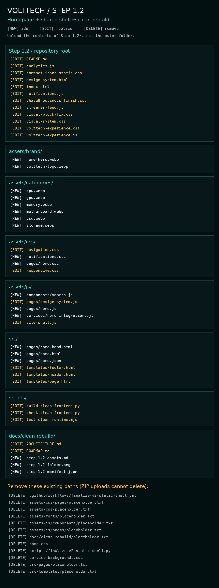

# Step 1.2 — Homepage and shared navigation

Project position: previous major **Step 0 — Repository audit ✅**; current major **Step 1 — Frontend foundation ⚡**; next major **Step 2 — Core commerce 🚫**.

Previous: **Step 1.1 — Foundation uploaded, verified and approved ✅**. Current: **Step 1.2 — Implementation and automated checks complete; upload/visual review pending 🧪**. Next: **Step 1.3 — Homepage verification and refinement 🚫**.

## Objective and lineage

Rebuild the homepage from new source markup against the supplied visual reference, connect its working integrations, and retire the replaced frontend implementation.

- Step identifier: **Step 1.2**
- Parent Step: **Step 1 — Frontend foundation**
- Previous Step: **Step 1.1 — Shared frontend foundation**
- Next planned Step: **Step 1.3 — Homepage verification and refinement**
- Repository: `VoltTechComputerCo/VoltTechComputerCo.github.io`
- Branch: **clean-rebuild**
- Exact parent / rollback commit: `8c120bc74512583cfb3f4cf3be292d13368b320e` — `Add files via upload`

The remote branch was inspected before implementation and again before packaging. Step 1.1's 32 uploaded files matched its delivery, and the user approved its appearance. No v3-prototype code was inherited. The user-supplied V3-named image archive supplied product photos only. No push, deployment, payment or database mutation is included in this delivery.

## Files added (19)

- `assets/brand/home-hero.webp`
- `assets/brand/volttech-logo.webp`
- `assets/categories/cpu.webp`
- `assets/categories/gpu.webp`
- `assets/categories/memory.webp`
- `assets/categories/motherboard.webp`
- `assets/categories/psu.webp`
- `assets/categories/storage.webp`
- `assets/css/notifications.css`
- `assets/css/pages/home.css`
- `assets/js/components/search.js`
- `assets/js/pages/home.js`
- `assets/js/services/home-integrations.js`
- `docs/clean-rebuild/step-1.2-assets.md`
- `docs/clean-rebuild/step-1.2-folder.png`
- `docs/clean-rebuild/step-1.2-manifest.json`
- `src/pages/home.head.html`
- `src/pages/home.html`
- `src/pages/home.json`

## Files changed (24)

- `README.md`
- `analytics.js`
- `assets/css/navigation.css`
- `assets/css/responsive.css`
- `assets/js/pages/design-system.js`
- `assets/js/site-shell.js`
- `contact-icons-static.css`
- `design-system.html`
- `docs/clean-rebuild/ARCHITECTURE.md`
- `docs/clean-rebuild/ROADMAP.md`
- `index.html`
- `notifications.js`
- `phase9-business-finish.css`
- `scripts/build-clean-frontend.py`
- `scripts/check-clean-frontend.py`
- `scripts/test-clean-runtime.mjs`
- `src/templates/footer.html`
- `src/templates/header.html`
- `src/templates/page.html`
- `streamer-feed.js`
- `visual-block-fix.css`
- `visual-system.css`
- `volttech-experience.css`
- `volttech-experience.js`

## Files deleted (12) — manual removal required

- `.github/workflows/finalize-v2-static-shell.yml`
- `assets/css/pages/placeholder.txt`
- `assets/css/placeholder.txt`
- `assets/fonts/placeholder.txt`
- `assets/js/components/placeholder.txt`
- `assets/js/pages/placeholder.txt`
- `docs/clean-rebuild/placeholder.txt`
- `home.css`
- `scripts/finalize-v2-static-shell.py`
- `service-backgrounds.css`
- `src/pages/placeholder.txt`
- `src/templates/placeholder.txt`

A ZIP upload does not delete repository files. Remove all paths in this list on **clean-rebuild** as part of this Step. The eight placeholder files have been replaced by real files in their folders. Do not delete the directories or other contents.

## Files superseded

- Root `home.css` and `service-backgrounds.css` are replaced by new source markup and `assets/css/pages/home.css` with shared foundation styles.
- The old `index.html` structure, inline diagnostic/review/creator presentation and legacy imports are replaced completely.
- The old V2 finaliser script/workflow is retired. Its source-rewriting job must not overwrite the clean templates.
- Homepage-only rules and hooks were removed from retained legacy CSS/JS. Those files still support unconverted routes.
- This README supersedes the Step 1.1 root handover. The prior commit and Step 1.1 manifest preserve its exact record.

## Backend systems touched

No backend data, schema, settings, RLS, deployed functions or secrets were changed. Frontend integration adaptations:

1. Public Store/Builder flags are read from existing `store_settings`; eight-second timeout, strict boolean handling, fail closed. Category slugs were verified against the actual `store_categories` table. At audit time both launch flags and direct payment were off.
2. Category cards use contextual WhatsApp enquiries while the catalogue is off/unavailable. The Builder CTA remains an enquiry until enabled. Existing Store and Builder access gates remain authoritative.
3. Cart count reads the existing storage key and listens to its existing event; it never changes cart data.
4. On the production origin only, existing cached sessions can initialise the pinned Supabase client and existing notification engine. Clean notifications have explicit header placement and accessible dialog/focus handling. Notification queries, roles, read actions, realtime and sound remain intact.
5. Existing analytics IDs/events and `conversion-context.js` handoffs are retained; homepage analytics and worker registration do not run on GitHack.
6. The creator adapter now exposes each row's `checked_at`; an unknown overall timestamp remains null. Homepage live labels require a check within twenty minutes. The inspected feed was stale, so this does not claim live creators from old data.

See `docs/clean-rebuild/ARCHITECTURE.md` for the dependency map and exact adaptation boundaries.

## Backend systems untouched

Authentication policies, customer profiles, orders, quotes, invoices, receipts, documents, saved builds, service/activity history, privacy workflows, Store catalogue/payment/checkout controllers, Yoco endpoints, compatibility engines, Signal Scan logic, Stream Scan logic, Supabase schemas/RLS, Discord/webhooks, email delivery and STATIC publishing/feed workflows. No launch flags or product prices were changed. Previously documented backend readiness issues remain open; this homepage is not a commerce-launch certification.

## Visual changes

- Wide teal-lit concept hero, powerful heading, clear upgrade/component CTAs and compact coverage facts.
- Eight correctly illustrated component cards; structured Builder/Signal Scan split; six compact service cards.
- Setup inspiration, upgrade guidance and STATIC reading in a dense desktop composition.
- Creator Hub and direct contact sections with truthful status and coverage language.
- Shared search, account/cart controls, native dialogs, self-hosted fonts, thin borders and unified palette.
- Deliberate 2-column phone category/service grids, stacked tools and editorial rows. Android sizes are included in the pending visual checklist.
- One optimised official logo source for the new shell (20,414 bytes); concept hero 140,788 bytes. Existing photos reused without duplicate root assets.

No invented stock, prices, reviews, ratings, delivery guarantees, partnership status or hardware telemetry. The hero is an illustrative brand concept. Product photos identify categories and do not advertise those specific SKUs as available.

## Functional changes

Shared navigation/footer remain source-owned and regenerate on both converted pages. Search covers named public service/tool/guide routes; product search remains inside the existing Store. Navigation and enquiry links remain usable without JavaScript. Search is progressively exposed when native dialogs are supported. Homepage anchors `services`, `contact`, creator IDs and enquiry destinations survive. Both converted pages use the tested clean service-worker boundary.

The shared-shell edits also update `design-system.html`, which is the only secondary changed page. Its inspection form is still local-only and sends nothing. No dummy newsletter or purchase form is introduced.

## SEO changes

Homepage title and description target practical PC repair/upgrade intent in Pretoria and remote support across South Africa. Includes en-ZA, production canonical, Open Graph metadata, one H1, semantic sections, real alt text and truthful Organization/Service structured data without a residential address. No Product/Offer/Review schema is invented.

**This rebuild branch remains noindex.** Remove the homepage noindex only in the approved release Step after whole-site SEO verification. The internal design-system route stays noindex. Existing routes and STATIC URLs are preserved.

## Dependencies

Runtime: browser CSS Grid, ES modules, Fetch/AbortController and native dialog enhancement. No frontend framework or package installation needed. Local WOFF2 fonts/licences remain from Step 1.1. Existing `supabase-config.js`, `streamer-feed.js`, `conversion-context.js`, `notifications.js`, manifest/icons and reused photos must remain in the repository.

For a cached production session only: Supabase JavaScript SDK is pinned to `2.116.0` via the existing jsDelivr delivery pattern. Current official Supabase auth documentation and changelog were consulted. Existing Google Analytics loads on the production homepage only. Search adds no external dependency.

Developer checks require Python 3 and Node.js 18+:

```sh
python3 scripts/build-clean-frontend.py
python3 scripts/check-clean-frontend.py
node scripts/test-clean-runtime.mjs
```

## Test checklist

Completed automatically / by source inspection:

- [x] Actual clean-rebuild HEAD and Step 1.1 upload verified.
- [x] Both generated pages match shared source.
- [x] Internal page paths, cross-page anchors, CSS/font/image paths and module imports resolve.
- [x] Image dimensions match actual files; repeated media references remain shared.
- [x] One header/main/H1/footer; no duplicate IDs or unresolved labels/ARIA references.
- [x] All changed/new JS parses; no inline event handlers/styles in generated HTML.
- [x] Mobile disclosure, Escape, link selection and breakpoint focus contracts.
- [x] Clean service-worker isolation plus preserved legacy/error/non-HTML behaviour.
- [x] Launch flags: enabled/disabled, invalid shapes, HTTP failure and network failure.
- [x] Cart: valid quantities and malformed/invalid storage.
- [x] Creator feed: recent data, stale/missing/future timestamps and unsafe login values.
- [x] GitHack-origin adapters do not access production auth storage, analytics or app registration.
- [x] Retired homepage files/imports/hooks removed; no V2 finaliser remains active.
- [x] Existing commerce/payment/Builder/Scan controllers and database writes untouched.
- [x] ZIP overlay matches working tree and rollback restores the exact parent tracked tree.
- [x] Whitespace/diff check.

After upload / manual verification — not claimed as passed:

- [ ] 360, 390, 412px: no horizontal overflow; readable labels and comfortable tap targets.
- [ ] Tablet, desktop and wide desktop: hero crop, grid density, heading sizes and footer.
- [ ] Search open/close, keyboard Tab/Escape/focus return, results and empty state.
- [ ] Mobile Menu behaviour and no-JavaScript fallback.
- [ ] Correct Store/Builder coming-soon/unavailable messages and enquiry links.
- [ ] Creator stale state, Signal Scan navigation, WhatsApp/email handoffs.
- [ ] Account/notification logged-in states and cart cross-tab behaviour on the intended origin.
- [ ] No missing assets, console errors or unexpected legacy imports in the uploaded preview.
- [ ] Installed service-worker update and navigation transitions on production/staging.
- [ ] User visual approval against the supplied reference.

The browser security policy blocks local-file navigation; this package has not been rendered in that browser. Source/runtime checks do not certify pixel accuracy or production auth/payment flows. The user will manually inspect GitHack after upload. No test order, payment, notification read mutation or message was sent.

## Upload instructions

1. Extract **Step-1.2.zip**. Its root folder is exactly **Step 1.2/**.
2. Select **clean-rebuild** in GitHub.
3. If using the Android folder-creation method, create only these currently missing folders with these copy/paste filenames:

```text
assets/brand/placeholder.txt
assets/categories/placeholder.txt
assets/js/services/placeholder.txt
```

4. Upload the **contents** of `Step 1.2/` at the repository root, preserving all paths; replace every changed file. Do not upload the enclosing Step folder as a repository directory.
5. Remove the paths under **Files deleted**, and delete any new placeholders created in step 3 once the real files are uploaded. Keep all real files inside those directories.
6. Suggested commit message: `Step 1.2 — clean homepage rebuild`.
7. Open the two links below and inspect the result. Tell me when uploaded; I will verify actual HEAD, hashes, removals and imports before issuing commit-pinned links and starting Step 1.3.

The manifest records SHA-256 hashes for every delivered file except itself, avoiding circular checksums. The folder image shows new/replacement/deleted paths and is included below. No local development setup is required for upload.

## Preview URLs — only pages worked on

**The new version is available after uploading this ZIP:**

- [Homepage](https://raw.githack.com/VoltTechComputerCo/VoltTechComputerCo.github.io/clean-rebuild/index.html)
- [Shared-shell inspection page](https://raw.githack.com/VoltTechComputerCo/VoltTechComputerCo.github.io/clean-rebuild/design-system.html)

These are branch links and can cache old content. A new commit-specific URL cannot exist before upload. After the upload is verified, use the issued actual SHA links for reliable review. GitHack is a visual/public-data preview; it does not share the production session. Destination pages outside these two remain their prior design pending their own Steps.

## Rollback

**Rollback target: Step 1.1 — approved uploaded foundation.** Exact commit: `8c120bc74512583cfb3f4cf3be292d13368b320e`.

Restore every path in the manifest's `changed` and `deleted` arrays from that exact commit, and remove every path in `added`. This returns the tracked repository to its previous state, including the old homepage and all original deleted files. Do not reset unrelated later work. An exact rollback rehearsal is included in the packaging checks. If requested, an exact **Rollback to Step 1.1.zip** will be delivered from these original Git bytes.

## Known limitations

- Upload, device rendering and visual approval are pending. No new commit SHA is invented.
- Only the homepage and shared inspection shell are migrated; service, commerce, account and creator destination pages retain their current design.
- Store, Builder and direct payment remain off in the inspected live settings. Real commerce requires later data/readiness work.
- Creator freshness was stale at inspection; the homepage reports live status unavailable until genuinely recent checks exist.
- Logged-in notifications and production worker transitions need their appropriate-origin QA; GitHack cannot validate production sessions.
- Supplied product-photo usage does not imply availability or a manufacturer relationship; provenance is recorded in `step-1.2-assets.md`.
- The homepage noindex must be deliberately removed during the release Step, not forgotten on production.

## Folder map



```text
Step 1.2/
├── README.md
├── analytics.js
├── assets/
│   ├── brand/
│   │   ├── home-hero.webp
│   │   └── volttech-logo.webp
│   ├── categories/
│   │   ├── cpu.webp
│   │   ├── gpu.webp
│   │   ├── memory.webp
│   │   ├── motherboard.webp
│   │   ├── psu.webp
│   │   └── storage.webp
│   ├── css/
│   │   ├── navigation.css
│   │   ├── notifications.css
│   │   ├── pages/
│   │   │   └── home.css
│   │   └── responsive.css
│   └── js/
│       ├── components/
│       │   └── search.js
│       ├── pages/
│       │   ├── design-system.js
│       │   └── home.js
│       ├── services/
│       │   └── home-integrations.js
│       └── site-shell.js
├── contact-icons-static.css
├── design-system.html
├── docs/
│   └── clean-rebuild/
│       ├── ARCHITECTURE.md
│       ├── ROADMAP.md
│       ├── step-1.2-assets.md
│       ├── step-1.2-folder.png
│       └── step-1.2-manifest.json
├── index.html
├── notifications.js
├── phase9-business-finish.css
├── scripts/
│   ├── build-clean-frontend.py
│   ├── check-clean-frontend.py
│   └── test-clean-runtime.mjs
├── src/
│   ├── pages/
│   │   ├── home.head.html
│   │   ├── home.html
│   │   └── home.json
│   └── templates/
│       ├── footer.html
│       ├── header.html
│       └── page.html
├── streamer-feed.js
├── visual-block-fix.css
├── visual-system.css
├── volttech-experience.css
└── volttech-experience.js
```
